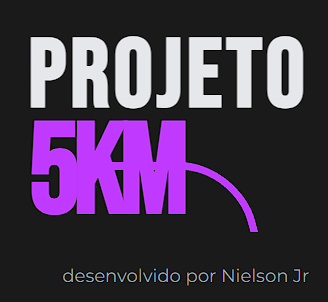

# Projeto 5Km

## 🚀 Sobre o Projeto

O **Projeto 5Km** é um aplicativo web interativo, desenvolvido para guiar corredores iniciantes através de um plano de treino de 8 semanas, com o objetivo de os levar do zero até a capacidade de correr 5 quilómetros continuamente.

Este projeto foi construído como uma ferramenta de treino pessoal, focada numa experiência de utilizador limpa, motivacional e altamente personalizada, com total responsividade para utilização em dispositivos móveis, especialmente iPhones.

---

## ✨ Funcionalidades Principais

-   **Plano de Treino Estruturado:** Tabela clara com 8 semanas de treinos progressivos.
-   **🏃‍♂️ Cronómetro Inteligente:** Um cronómetro de intervalos que interpreta o treino do dia (tempos de corrida e caminhada) e guia o utilizador.
-   **🔊 Alertas de Voz Personalizados:** Comandos de voz para iniciar, correr, caminhar e finalizar o treino, garantindo que o utilizador não precise de olhar para o ecrã.
-   **💾 Acompanhamento de Progresso:** Marque treinos como concluídos e veja o seu progresso. O estado é guardado localmente no navegador (`localStorage`).
-   **👤 Personalização:** O aplicativo cumprimenta o utilizador pelo nome, criando uma experiência mais pessoal.
-   **📱 Design Responsivo:** Interface moderna, com tema escuro, e totalmente otimizada para a utilização em smartphones durante a corrida.

---

## 🛠️ Tecnologias Utilizadas

Este projeto foi construído utilizando as seguintes tecnologias web:

-   **HTML5:** Para a estrutura semântica do conteúdo.
-   **CSS3:** Para a estilização, design responsivo e tema escuro.
-   **JavaScript (ES6+):** Para toda a interatividade, lógica do cronómetro, manipulação do DOM e armazenamento local.

---

## ⚙️ Como Utilizar

1.  **Aceda ao site:**
    -   A maneira mais fácil é aceder à versão publicada no GitHub Pages: **[https://[SEU_USUARIO_GITHUB].github.io/[NOME_DO_REPOSITORIO]/](https://[SEU_USUARIO_GITHUB].github.io/[NOME_DO_REPOSITORIO]/)**

2.  **Para executar localmente:**
    -   Faça o clone ou o download deste repositório.
    -   Certifique-se de que todos os arquivos de áudio (`.opus`) estão na mesma pasta que os outros arquivos.
    -   Abra o ficheiro `index.html` no seu navegador de preferência.

---

## 👨‍💻 Criador

Este projeto foi idealizado e desenvolvido por **Nielson Jr**.

---
